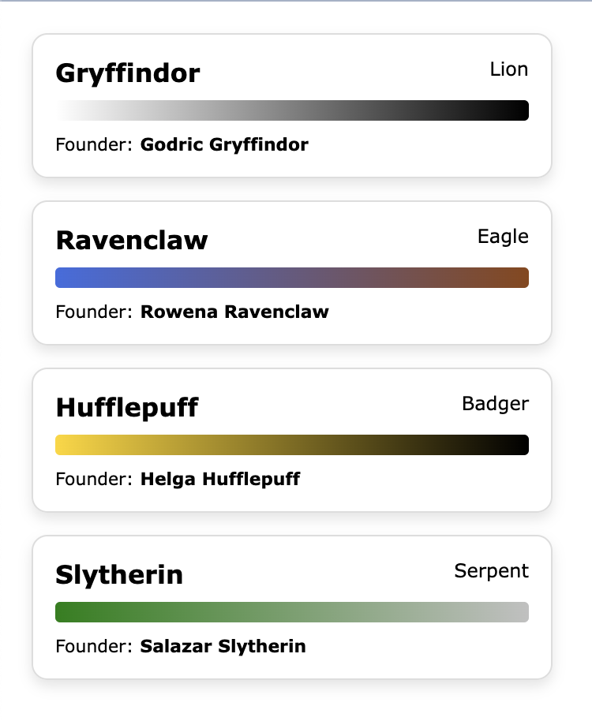

# Render Houses List

This is a simple react application that will call a API and
render the data to display a list of houses.



# Features
- Displays the list of houses with the info in a card view.
- Dynamically renders the gradient color according to the house color data.

# Technologies Used
- ReactJs
- Typescript
- Sass
- Vite

# Getting Started with React + TypeScript + Vite

This template provides a minimal setup to get React working in Vite with HMR and some ESLint rules.

## Install dependencies

`npm install`

## Available Scripts

In the project directory, start the development server:

### `npm run dev`

Runs the app in the development mode.\
Open [http://localhost:5173](http://localhost:5173) to view it in the browser.

### `npm run build`

Builds the app for production to the `build` folder.\
It correctly bundles React in production mode and optimizes the build for the best performance.

### Data Fetching
- Implemented data fetching using a `custom hook` called `useFetchHouses`. This hook is responsible for fetching houses data from an external source.

### Styling
- Used `Verdana` font.
- For styling, used the `BEM (Block Element Modifier)` methodology, ensuring clear and maintainable class names. For more information see this [documentation](https://en.bem.info/methodology/quick-start/#introduction)
- Utilized `SCSS modules` for styling, which provide a modular and organized way to manage styles for each component separately.
- Created a `mixin` for fonts to maintain consistency in `typography` across the application.

### TypeScript
- TypeScript is integrated into the project to provide `type safety` and enhance code quality.
- This ensures that the code is robust and less prone to `runtime errors`.

### Commit Convention
- To ensure readability and consistency in `commit messages`, the conventional commit format is used for writing commit messages that are `clear, concise, and informative`.
- Each commit message should adhere to the following pattern:

```
<type>(<scope>): <description>

[optional body]

[optional footer]

```

Where:

- `<type>` specifies the type of the commit (e.g., feat, fix, chore, docs, style).
- `<scope>` is optional and indicates the scope of the commit (e.g., component name, module).
- `<description>` is a short, concise description of the change.
- `[optional body]` provides additional context or details about the change.
- `[optional footer]` includes any relevant issue or breaking change references.

This convention helps in tracking and understanding the `purpose` of each commit.
See the section about [conventional commits](https://www.conventionalcommits.org/en/v1.0.0/#specification) for more information.